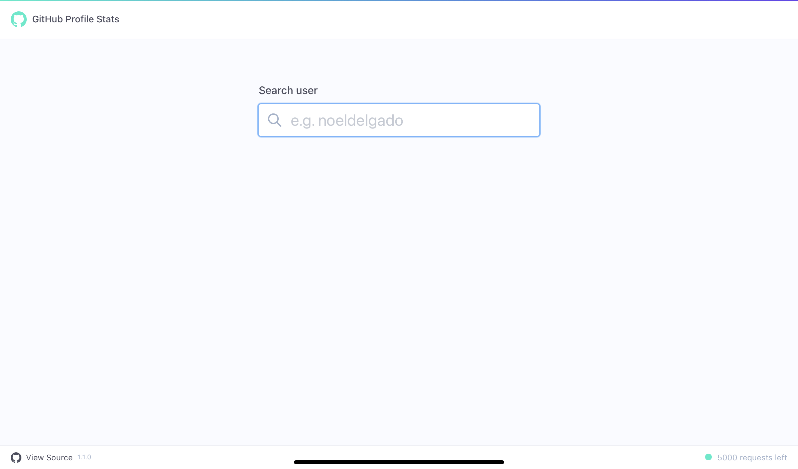

# gh-profile-stats


--
(https://abc-hubstats.vercel.app)

## Install

```sh
npm install
# or
yarn install

# copy and fill the env file
cp .env.example .env
```

## Development

Run the development server:

```bash
npm run dev
# or
yarn dev
```

Open [http://localhost:3000](http://localhost:3000) with your browser to see the result.
